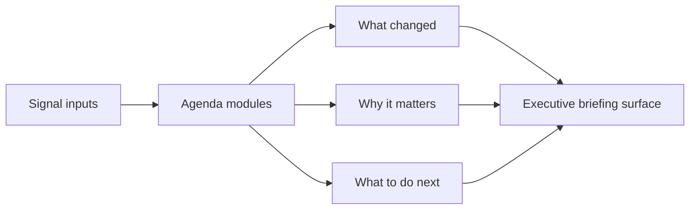

# Executive Briefing Studio

<p align="center">
  
  
  
  
</p>

## Executive Summary

Executive Briefing Studio is a recruiter-ready React + TypeScript flagship for turning fragmented operating signals into narrative, board-ready briefings.

Instead of surfacing one more admin panel, it frames revenue, growth, risk, AI, and operations as a polished executive story: what changed, why it matters, and what leadership should do next.

## Recruiter Takeaway

This project is meant to show:

- strategy-to-interface thinking, not just screen assembly
- an ability to translate operational complexity into executive communication
- product taste, visual hierarchy, and editorial presentation skill

## Overview

| Area | What it covers |
| --- | --- |
| Hero summary | High-level pack readiness, signal volume, and decision pressure |
| Agenda spine | Three briefing modules that shape the conversation |
| Callout layer | What changed, why it matters, and what to do next |
| Presentation surface | Slide-like storytelling cards with a strategy-room feel |

## Why This Exists

Many organizations produce leadership updates that are technically accurate but operationally weak. The problem is usually not data availability. It is translation.

Executive Briefing Studio treats the briefing itself as a product:

- it prioritizes narrative over raw output
- it imposes sequencing on complexity
- it turns different system signals into action-oriented communication

## Architecture



More implementation notes live in [docs/architecture.md](./docs/architecture.md).

## Screenshots

### Hero and Summary


### Agenda Spine


### Executive Callouts


### Presentation Surface


## Local Run

```powershell
Set-Location "C:\Users\chaus\dev\repos\executive-briefing-studio"
npm install
npm run dev
```

## Validation

```powershell
npm test
npm run build
npm run lint
```

## Portfolio Links

- [Kinetic Gain](https://kineticgain.com/)
- [Skills / Portfolio](https://mizcausevic.com/skills/)
- [LinkedIn](https://www.linkedin.com/in/mirzacausevic)
- [Medium](https://medium.com/@mizcausevic)
- [GitHub](https://github.com/mizcausevic-dev)
