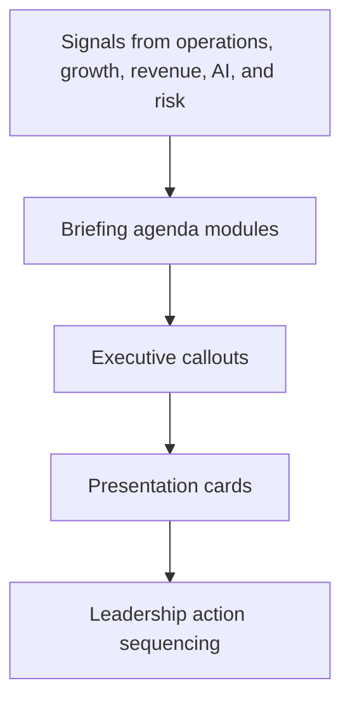

# Executive Briefing Studio Architecture

## Intent

Executive Briefing Studio is designed as a presentation-grade internal tool. It is not a dashboard clone. The interface is intentionally structured around decision framing and executive communication.

## Core Flow

## Design Direction

This project intentionally leans more editorial than software-admin:

- serif-driven headlines
- asymmetrical section rhythm
- boardroom presentation feel
- briefing modules instead of dashboards

## Repository Layout

- `src/App.tsx`: main briefing experience
- `src/data.ts`: agenda, callouts, and presentation content
- `src/styles.css`: editorial visual system
- `README.md`: recruiter-facing positioning
- `screenshots/*.svg`: GitHub-ready visual assets
